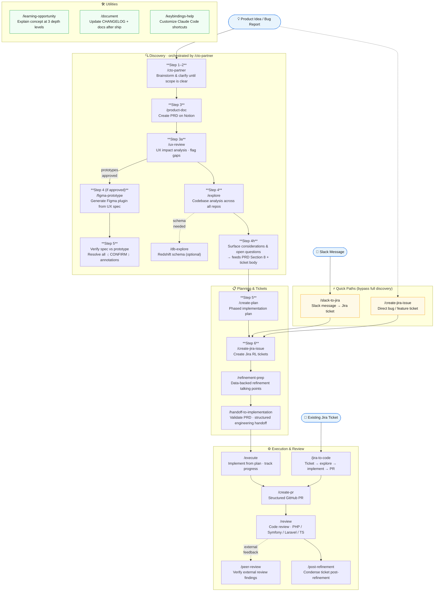

# Workflow Diagram

Full pipeline from idea to shipped code, with every agent/skill mapped to its step.



---

## Stage Summary

| Stage | Skills | Entry | Output |
|---|---|---|---|
| Discovery | `/cto-partner` · `/product-doc` · `/ux-review` · `/figma-prototype` · `/explore` · `/db-explore` | Raw idea or bug report | PRD on Notion + UX spec + prototype + open questions table |
| Planning | `/create-plan` · `/create-jira-issue` · `/refinement-prep` · `/handoff-to-implementation` | Exploration output | Phased plan + Jira tickets + engineering handoff |
| Execution | `/execute` · `/jira-to-code` · `/create-pr` · `/review` · `/peer-review` · `/post-refinement` | Jira ticket or plan | Merged PR + clean ticket |
| Quick paths | `/slack-to-jira` · `/create-jira-issue` | Slack message or known bug | Jira ticket (no full discovery) |
| Utilities | `/learning-opportunity` · `/document` · `/keybindings-help` | Any point in workflow | Teaching, docs update, config |

---

## Skill Invocation Map

Who calls whom (explicit chaining between skills):

```
/cto-partner
  ├── calls /product-doc        (Step 3)
  ├── calls /ux-review          (Step 3a)
  │     └── calls /figma-prototype  (Step 4, if approved)
  └── calls /explore            (Step 4)

/jira-to-code
  └── calls /create-pr          (internally)

/ux-review
  └── calls /figma-prototype    (Step 4, if approved)
```

All other skills are invoked directly by the user.
